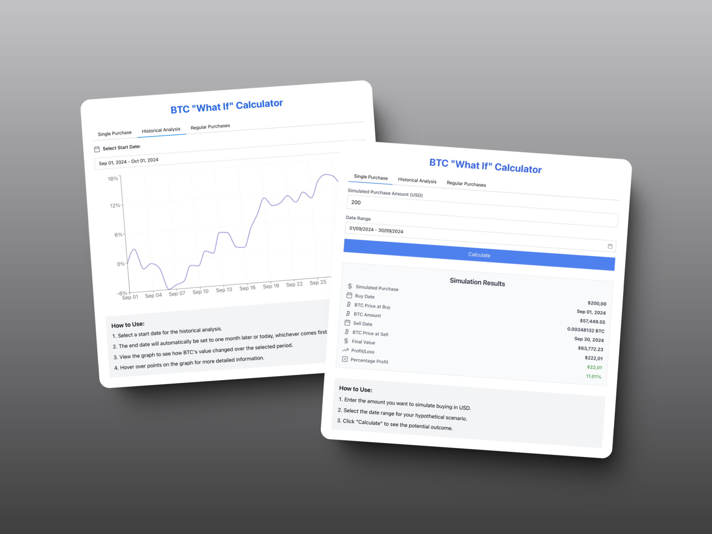

# BTC "What If" Calculator

## Introduction

The **BTC "What If" Calculator** is a web application that allows you to simulate Bitcoin investments under different scenarios. It provides insights into potential profits or losses based on historical Bitcoin price data.

### Features:

- **Single Purchase**: Simulate a one-time Bitcoin purchase and calculate potential profit or loss over a specific date range.
- **Historical Analysis**: Analyze Bitcoin's historical performance over a selected period.
- **Regular Purchases**: Simulate regular Bitcoin purchases (daily, weekly, or monthly) and calculate cumulative returns over time.

## Screenshot

## Services Used

This application utilizes the following service:

- **Alpaca Markets API**: Fetches historical Bitcoin price data for calculations and charting.

---

_Feel free to clone the repository and explore the application yourself!_
